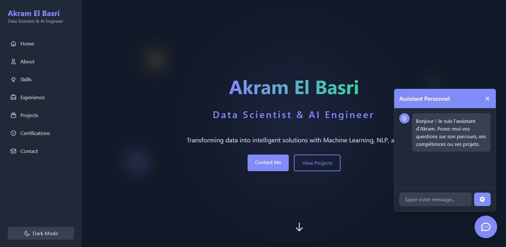

# Akram El Basri Portfolio

Welcome to the personal portfolio repository of **Akram El Basri**. This project showcases my professional experience, skills, certifications, and projects in a visually appealing and accessible format.

## Table of Contents

- [About](#about)
- [Features](#features)
- [Screenshots](#screenshots)
- [Getting Started](#getting-started)
- [Usage](#usage)
- [Project Structure](#project-structure)
- [Technologies Used](#technologies-used)
- [Contributing](#contributing)
- [License](#license)
- [Contact](#contact)

---

## About

This is a personal portfolio website designed to present my CV, certifications, and professional background. It includes downloadable resources and visual representations of my achievements.

## Features

- Responsive and modern design
- Downloadable CV in PDF format
- Display of certifications and achievements
- Profile and project images
- Easy navigation and user-friendly interface

## Screenshots

<<<<<<< HEAD
> screenshots of your website here. :_
=======
> _ Screenshots of my website here:_
>>>>>>> 3e6f76b556b371c99fdad19c50bda755c752c512
>
> 

## Getting Started

To view or edit this portfolio locally:

1. **Clone the repository:**
   ```bash
   git clone https://github.com/your-username/Akram-el-basri.git
   cd Akram-el-basri
   ```

2. **Open `index.html` in your browser:**
   - Double-click `index.html` or open it with your preferred browser.

> _No build steps or dependencies are required; this is a static HTML project._

## Usage

- View the portfolio online or locally.
- Download the CV from the provided link.
- Browse certifications and profile information.

## Project Structure

```
Akram-el-basri/
  ├── img/
  │   ├── Akram_elbasri_cv.pdf
  │   ├── certificat_hackatho.jpg
  │   ├── certificat_hackathon1.jpg
  │   ├── certificate_Data_Analysis.png
  │   ├── profile.png
  │   └── profile2.png
  ├── index.html
  └── README.md
```

- `img/`: Contains images and PDF files used in the portfolio.
- `index.html`: Main HTML file for the website.
- `README.md`: Project documentation.

## Technologies Used

- HTML5
- CSS3 (inline or external, as per your project)
- JavaScript

## Contributing

Contributions are welcome! Please open an issue or submit a pull request for any improvements or suggestions.

## License

This project is open source and available under the [MIT License](LICENSE) _(add a LICENSE file if you want)_.

## Contact

- **Name:** Akram El Basri
- **Email:** [elbasriakram771@gmail.com]
- **LinkedIn:** [https://www.linkedin.com/in/akram-el-basri-900181228/]
- **Portfolio:** [https://akramelbasri.github.io/Akram-el-basri]

---
